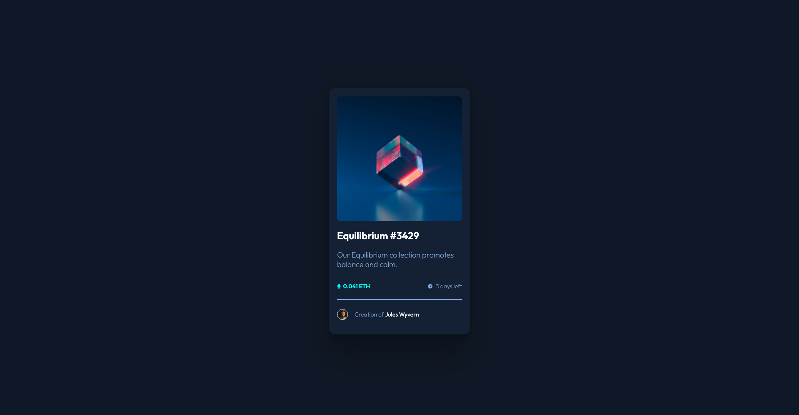
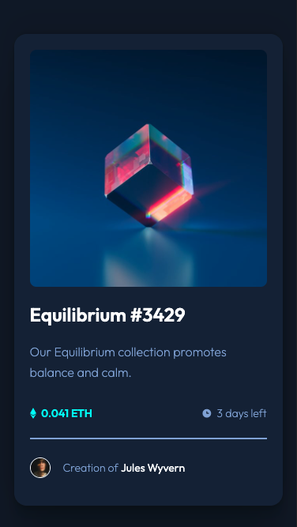

# Frontend Mentor - NFT preview card component solution

This is my solution to the [NFT preview card component challenge on Frontend Mentor](https://www.frontendmentor.io/challenges/nft-preview-card-component-SbdUL_w0U).

## Table of contents

- [Overview](#overview)
  - [The challenge](#the-challenge)
  - [Screenshot](#screenshot)
  - [Links](#links)
- [My process](#my-process)
  - [Built with](#built-with)
  - [What I learned](#what-i-learned)
  - [Continued development](#continued-development)
  - [Useful resources](#useful-resources)
- [Author](#author)

## Overview

### The challenge

Users should be able to:

- View the optimal layout depending on their device's screen size
- See hover states for interactive elements

### Screenshot

#### Desktop preview

#### Mobile preview

### Links

- [Solution URL](https://github.com/NellaTL/frontendmentor.io/tree/main/nft-preview-card-component-main)
- [Live Site URL](https://nft-preview-card-component-nella.netlify.app/)

## My process

### Built with

- Semantic HTML5 markup
- CSS custom properties
- Flexbox

### What I learned

After focusing heavily on studying Javascript for the past few weeks this project has been a great reintroduction to using both HTML and CSS, more specifically Flexbox. 

The project allowed me to gain a better understanding of implementing hover states using the 'Position' property along with introducing transitions for better looking results. 

### Continued development

Although only briefly touching on them in this project, 'Media Queries' are something I need to spend more time on to fully understand and look to implement a mobile-first design process.  

### Useful resources

- [w3 schools CSS Image overlay](https://www.w3schools.com/howto/howto_css_image_overlay.asp) - This helped me understand the logic behind adding the overlay on hover. 

## Author

- Website - [Luke Allen](https://github.com/NellaTL)
- Frontend Mentor - [NellaTL](https://www.frontendmentor.io/profile/NellaTL)
