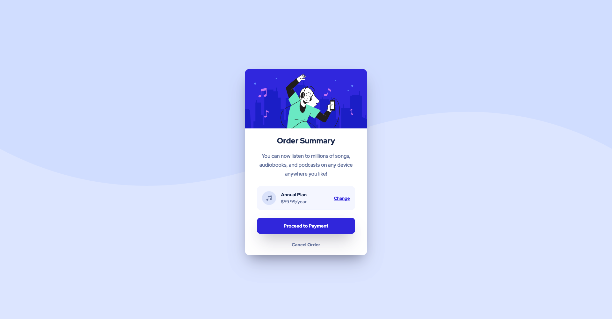

# Frontend Mentor - Order summary card solution

This is my solution to the [Order summary card challenge on Frontend Mentor](https://www.frontendmentor.io/challenges/order-summary-component-QlPmajDUj).

## Table of contents

- [Overview](#overview)
  - [The challenge](#the-challenge)
  - [Screenshot](#screenshot)
  - [Links](#links)
- [My process](#my-process)
  - [Built with](#built-with)
  - [What I learned](#what-i-learned)
  - [Continued development](#continued-development)
  - [Useful resources](#useful-resources)
- [Author](#author)

## Overview

### The challenge

Users should be able to:

- See hover states for interactive elements

### Screenshot

#### Desktop preview

#### Mobile preview

### Links

- [Solution URL](https://github.com/NellaTL/frontendmentor.io/tree/main/order-summary-component-main)
- [Live Site URL](https://order-summary-component-main-la.netlify.app/)

## My process

### Built with

- Semantic HTML5 markup
- CSS custom properties 
- Flexbox
- BEM methodology 

### What I learned

After feedback on my previous challenge suggested I look into adopting the BEM methodology for CSS classes I spent some time looking into how I could incorporate it into my routine workflow. After my first time using it I can definitely see the benefits, especially for larger scale projects. 

### Continued development

Moving into future projects I'm going to continue to use BEM and look to reduce the amount of unnecessary code.

### Useful resources

[CSS box shadows](https://getcssscan.com/css-box-shadow-examples) - This is a super useful tool for getting box shadows fast. 

## Author

Website - [Luke Allen](https://github.com/NellaTL)
Frontend Mentor - [NellaTL](https://www.frontendmentor.io/profile/NellaTL)

